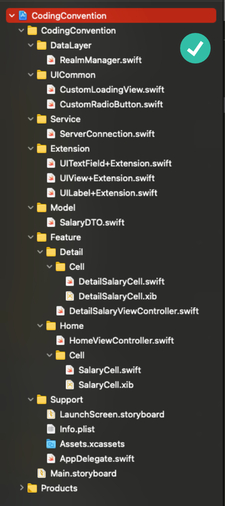

# Coding Convention

## Table of contents

* [Đặt tên biến](#Đặt-tên-biến)
* [Đặt tên hàm](#Đặt-tên-hàm)
* [Đặt tên class, struct, enum, protocol](#Đặt-tên-class,-struct,-enum,-protocol)
* [Spacing](#Spacing)
* [Comment](#Comment)
* [Access Control](#Access-Control)
* [Self & Closure](#Self-&-Closure)
* [Magic number & Duplicate code](#Magic-number-&-Duplicate-code)
* [Code Organization](#Code-Organization)
* [Scene Delegate](#Scene-Delegate)
* [Computed Property](#Computed-Property)
* [Optional](#Optional)
* [Dấu chẩm phẩy](#Dấu-chẩm-phẩy)
* [Dấu ngoặc đơn](#Dấu-ngoặc-đơn)
* [Multi-line String](#Multi-line-String)
* [Golden Path](#Golden-Path)
* [Type Inferred Context](#Type-Inferred-Context)
* [Reference](#Reference)


## Đặt tên biến

- Hai quy tắc cơ bản nhất khi đặt tên biến: dùng **`tiếng Anh`** thay vì tiếng Việt, sử dụng **`lowerCamelCase`** (kiểu lạc đà) thay vì `snake_case`

***Not Preferred***:
```swift
 private let height_normal_avatar: CGFloat = 60.0
 private let chieuRongNormalAvatar: CGFloat = 120.0
 ```
***Preferred***:
```swift
 private let heightNormalAvatar: CGFloat = 60.0
 private let widthNormalAvatar: CGFloat = 120.0
 ```

 - Khi đặt tên biến, hãy chú trọng đến sự **`rõ ràng, rành mạch`** hơn là sự ngắn gọn. Cố gắng làm sao khi đọc tên biến lên, ta có thể tưởng tượng được ngay biến đó có nhiệm vụ gì hoặc đang ám chỉ đến đối tượng nào. Vì vậy khi đặt tên biến không nên viết tắt và cũng không nên đặt tên giống với các đối tượng của hệ thống

 ***Not Preferred***:
```swift
@IBOutlet private weak var tableView: UITableView!
@IBOutlet private weak var imgAvatar: UIImageView!
@IBOutlet private weak var lblbName: UILabel!

private var bool: Bool = false
 ```
***Preferred***:
```swift
@IBOutlet private weak var salaryTableView: UITableView!
@IBOutlet private weak var avatarImageView: UIImageView!
@IBOutlet private weak var nameLabel: UILabel!

private var isLoadingState: Bool = false
 ```

 - Tên biến nên được bắt đầu bằng 1 danh từ và khi khai báo biến, nên **`khai báo luôn kiểu dữ liệu của biến`** đó (điều này có thể làm giảm được phần nào thời gian compile của app)

 ***Not Preferred***:
```swift
private var dataSalaryArray = [Salary]()
private var isLoadingState = false
 ```
***Preferred***:
```swift
private var dataSalaryArray: [Salary] = [Salary]()
private var isLoadingState: Bool = false
 ```

 -	Với những biến cùng kiểu, nên đặt tên có sự **`thống nhất`** từ trên xuống dưới, tránh tình trạng mỗi biến 1 style đặt tên khác nhau. Ví dụ trong trường hợp với height và top constraint của đối tượng `avatarImageView`

***Not Preferred***:
```swift
@IBOutlet private weak var heightOfAvatarImageView: NSLayoutConstraint!
@IBOutlet private weak var topConstraintForAvatarImageView: NSLayoutConstraint!
 ```
***Preferred***:
```swift
@IBOutlet private weak var heightConstraintAvatarImageView: NSLayoutConstraint!
@IBOutlet private weak var topConstraintAvatarImageView: NSLayoutConstraint!
 ```

 - Ngoài ra, khi khai báo biến nên lựa chọn syntax ngắn gọn thay vì dùng syntax đầy đủ

 ***Preferred***:
```swift
var deviceModels: [String]
var employees: [Int: String]
var faxNumber: Int?
```

***Not Preferred***:
```swift
var deviceModels: Array<String>
var employees: Dictionary<Int, String>
var faxNumber: Optional<Int>
```

 ## Đặt tên hàm
 - Cũng giống như việc đặt tên biến, việc đặt tên hàm cũng có các quy tắc tương tự: dùng **`tiếng Anh`**, dùng kiểu **`lowerCamelCase`** (kiểu lạc đà)
 - Tên hàm thường được bắt đầu bằng **`động từ`**, tên hàm phải **`rõ ràng, rành mạch`**. Cố gắng làm sao khi đọc tên hàm lên, ta có thể tưởng tượng được ngay hàm đó làm nhiệm vụ gì.
 -	Đối với những function có nhiều param, nên đặt mỗi param trên 1 dòng và căn lề cho chúng. Ngoài ra, với những param có giá trị mặc định, nên đặt chúng ở cuối list parameter. Còn những param không có giá trị mặc định thì nên đặt lên đầu

***Not Preferred***:
```swift
func setAttributedString(string: String, font: UIFont, lineSpacing: CGFloat, alignment: NSTextAlignment = .left, icon: UIImage? = nil, íconRect: CGRect? = nil) -> NSAttributedString {
    // Do something
}
 ```
***Preferred***:
```swift
func setAttributedString(string: String, 
                        font: UIFont, 
                        lineSpacing: CGFloat, 
                        lignment: NSTextAlignment = .left, 
                        icon: UIImage? = nil, 
                        íconRect: CGRect? = nil) -> NSAttributedString {
    // Do something
}
 ```

 - Bên cạnh việc sử dụng param 1 cách truyền thống, có thể sử dụng thêm **`specifying argument labels`** (thêm 1 label vào trước tên của param) hoặc **`omitting argument labels`** (thêm dấu gạch dưới _ vào trước tên của param). Điều này làm cho việc gọi tên hàm sẽ trở nên gần gũi hơn với ngôn ngữ tự nhiên. Tham khảo thêm tại [Function](https://docs.swift.org/swift-book/LanguageGuide/Functions.html/)


```swift
func greet(person: String, from hometown: String) -> String {
    return "Hello \(person)!  Glad you could visit from \(hometown)."
}

print(greet(person: "Bill", from: "Cupertino"))
// Prints "Hello Bill!  Glad you could visit from Cupertino."
 ```

```swift
func welcome(_ person: String, from hometown: String) -> String {
    return "Hello \(person)!  Glad you could visit from \(hometown)."
}

print(welcome("Bill", from: "Cupertino"))
// Prints "Hello Bill!  Glad you could visit from Cupertino."
 ```


 ## Đặt tên class, struct, enum, protocol
 -	Đặt tên class, struct, enum và protocol ta cũng sử dụng **`tiếng Anh`** nhưng sẽ dùng kiểu **`UpperCamelCase`** – đây là điểm khác biệt so với function và property
 -	Tên class, struct, enum, protocol thường được bắt đầu bằng **`danh từ`** và khi đặt tên cũng cần ưu tiên sự **`rõ ràng, rành mạch`**.

 ## Spacing
- Các dấu ngoặc nhọn mở đầu cho các function và các dấu ngoặc sau các biểu thức `if/else/switch/while…` đều phải được mở trên cùng 1 dòng với câu lệnh, có thêm 1 khoảng trắng phía bên trái và đóng trên 1 dòng khác

***Not Preferred***:
```swift
if user.isHappy
{
  // Do something
}
else {
  // Do something else
}
 ```
***Preferred***:
```swift
if user.isHappy {
  // Do something
} else {
  // Do something else
}
 ```

 -	Nên có 1 dòng trắng giữa các function, giữa các block code và giữa khu vực khai báo các properties với khu vực ánh xạ các outlet. Trong 1 function cũng cần có những dòng trắng để phân tách các chức năng nhỏ trong function đó.

 ***Not Preferred***:
```swift
import UIKit
class SettingScreen: UIViewController {
    @IBOutlet private weak var settingTitleLabel: UILabel!
    @IBOutlet private weak var stateSettingSwitch: UISwitch!
    var snapView: UIView?
    var snapTabbarView: UIView?
    var tabbarView: UIView?
    override func viewDidLoad() {
        super.viewDidLoad()
    }
    override func viewWillAppear(_ animated: Bool) {
        super.viewWillAppear(animated)
    }
}
extension SettingScreen {
    func loadData(state: String) {
        DispatchQueue.main.async {
            self.settingTitleLabel.text = state
        }
    }
}
 ```
***Preferred***:
```swift
import UIKit

class SettingScreen: UIViewController {
    @IBOutlet private weak var settingTitleLabel: UILabel!
    @IBOutlet private weak var stateSettingSwitch: UISwitch!

    var snapView: UIView?
    var snapTabbarView: UIView?
    var tabbarView: UIView?

    override func viewDidLoad() {
        super.viewDidLoad()
    }

    override func viewWillAppear(_ animated: Bool) {
        super.viewWillAppear(animated)
    }
}
extension SettingScreen {
    func loadData(state: String) {
        DispatchQueue.main.async {
            self.settingTitleLabel.text = state
        }
    }
}
 ```

 -	Dấu 2 chấm luôn không có khoảng trắng ở phía bên trái và có 1 khoảng trắng ở phía bên phải. Ngoại trừ 3 trường hợp: toán tử 3 ngôi `A ? B : C`, empty dictionary `[:]` và #selector syntax `addTarget(_:action:)`

***Not Preferred***:
```swift
 class ViewController : UIViewController {
     private var data :[String:CGFloat] = ["A" : 1.2, "B":3.2]
 }
 ```
***Preferred***:
```swift
 class ViewController: UIViewController {
     private var data: [String: CGFloat] = ["A": 1.2, "B": 3.2]
 }
 ```

 -	Không nên có khoảng trắng ở cuối mỗi dòng code nhưng nên có thêm 1 dòng trắng ở cuối mỗi file
 -	Không có giới hạn nhất định cho số ký tự trên mỗi dòng code. Tuy nhiên mỗi dòng code của bạn không nên có quá 100 ký tự. Có 1 vài cách để làm giảm số lượng ký tự trên 1 dòng code:
    + Đối với function có nhiều param và các param có tên quá dài, bạn có thể xuống dòng và căn lề cho chúng (đã để cập ở trên)
    + Đối với các biểu thức tính toán, bạn có thể đặt ra các biến phụ thay vì gộp chung lại vào 1 biểu thức

***Not Preferred***:
```swift
// Tính diện tích tam giác khi biết độ dài 3 cạnh (hệ thức Heron)
func calculateSquareTriangleUsingHeron(firstEdge: CGFloat,
                                       secondEdge: CGFloat,
                                       thirdEdge: CGFloat) -> CGFloat {
    return sqrt(((firstEdge + secondEdge + thirdEdge) / 2) * ((firstEdge + secondEdge + thirdEdge) / 2 - firstEdge) * ((firstEdge + secondEdge + thirdEdge) / 2 - secondEdge) * ((firstEdge + secondEdge + thirdEdge) / 2 - thirdEdge))
}
 ```
***Preferred***:
```swift
// Tính diện tích tam giác khi biết độ dài 3 cạnh (hệ thức Heron)
func calculateSquareTriangleUsingHeron(firstEdge: CGFloat,
                                       secondEdge: CGFloat,
                                       thirdEdge: CGFloat) -> CGFloat {
    let halfPerimeter: CGFloat = (firstEdge + secondEdge + thirdEdge) / 2
    let halfPerimeterMinusA: CGFloat = halfPerimeter - firstEdge
    let halfPerimeterMinusB: CGFloat = halfPerimeter - secondEdge
    let halfPerimeterMinusC: CGFloat = halfPerimeter - thirdEdge
    let doubleSquare: CGFloat = halfPerimeter * halfPerimeterMinusA * halfPerimeterMinusB * halfPerimeterMinusC
    let square: CGFloat = sqrt(doubleSquare)
    return square
}
 ```

## Comment
-	Đôi khi ta cần phải add comment để chú thích cho các đoạn code, phục vụ cho quá trình maintenance sau này. Tất nhiên là khi code được thay đổi thì comment cũng cần được update theo.
-	Khi comment, không nên dùng C-style `/*…*/` mà nên dùng double-slash `//` hoặc triple-slash `///`. Cũng không nên để code và comment xuất hiện trên cùng 1 dòng

## Access Control
-	Các function và property nên mặc định để là **`private`** hoặc **`fileprivate`** để đảm bảo tính đóng gói trong lập trình. Nên hạn chế việc sử dụng `open`, `public` hoặc `internal`. Tham khảo [Access Control](https://docs.swift.org/swift-book/LanguageGuide/AccessControl.html)

***Not Preferred***:
```swift
extension ViewController: UITableViewDataSource {
    func tableView(_ tableView: UITableView, numberOfRowsInSection section: Int) -> Int {
        return dataSalaryArray.count
    }
    
    func tableView(_ tableView: UITableView, cellForRowAt indexPath: IndexPath) -> UITableViewCell {
        guard let cell = salaryTableView.dequeueReusableCell(withIdentifier: "SalaryCell",
                                                            for: indexPath) as? SalaryCell else {
            return UITableViewCell()
        }
        cell.monthLabel.text = dataSalaryArray[indexPath.row].month
        cell.incomeLabel.text = dataSalaryArray[indexPath.row].incomeLabel
        return cell
    }
}

class SalaryCell: UITableViewCell {
    @IBOutlet weak var monthLabel: UILabel!
    @IBOutlet weak var incomeLabel: UILabel!
    
    override func awakeFromNib() {
        super.awakeFromNib()
    }
}
 ```
***Preferred***:
```swift
extension ViewController: UITableViewDataSource {
    func tableView(_ tableView: UITableView, numberOfRowsInSection section: Int) -> Int {
        return dataSalaryArray.count
    }
    
    func tableView(_ tableView: UITableView, cellForRowAt indexPath: IndexPath) -> UITableViewCell {
        guard let cell = salaryTableView.dequeueReusableCell(withIdentifier: "SalaryCell",
                                                            for: indexPath) as? SalaryCell else {
            return UITableViewCell()
        }
        cell.setupData(data: dataSalaryArray[indexPath.row])
        return cell
    }
}

class SalaryCell: UITableViewCell {
    @IBOutlet private weak var monthLabel: UILabel!
    @IBOutlet private weak var incomeLabel: UILabel!
    
    override func awakeFromNib() {
        super.awakeFromNib()
    }
    
    func setupData(data: Salary) {
        monthLabel.text = data.month
        incomeLabel.text = "\(data.income)"
    }
}
 ```

-	Khi khai báo property, các từ khoá liên quan đến access control nên được đặt lên đầu. Chỉ có 1 số từ khoá được đứng trước chúng đó là: `static`, `@IBAction`, `@IBOutlet`, `@discardableResult`.

***Not Preferred***:
```swift
@IBOutlet weak private var salaryTableView: UITableView!
@IBOutlet weak private var avatarImageView: UIImageView!
@IBOutlet weak private var fullNameLabel: UILabel!
 ```
***Preferred***:
```swift
@IBOutlet private weak var salaryTableView: UITableView!
@IBOutlet private weak var avatarImageView: UIImageView!
@IBOutlet private weak var fullNameLabel: UILabel!
 ```

 ## Self & Closure
-	Không nên sử dụng từ khoá `self` một cách tuỳ ý. Chỉ dùng `self` trong 2 trường hợp:
    +  Khi trình biên dịch yêu cầu, thường là khi đang trong biểu thức closure
    ```swift
    func loadData() {
        DispatchQueue.main.async {
            self.salaryTableView.reloadData()
        }
    }
     ```
    + Khi đang ở trong hàm init, ta cần phân biệt giữa property của object và param của hàm init
    ```swift
    class Salary {
        var income: Int
        var month: String
    
        init(income: Int, month: String) {
            self.income = income
            self.month = month
        }
    }
     ```
-	Đối với closure, ta có thể dùng `trailling closure syntax` trong trường hợp chỉ có duy nhất 1 biều thức closure trong list parameter. Còn nếu có nhiều hơn 1, ta phải giữ lại tên cho các closure đó.

***Not Preferred***:
```swift
// Trong trường hợp này, chỉ có duy nhất 1 biểu thức closure nên không cần thiết phải để lại label "animations"
UIView.animate(withDuration: 1, animations: {
    self.avatarImageView.alpha = 0.0
})
        
// Trường hợp này có 2 biểu thức closure, vì vậy nên để lại cả 2 label "animations" và "completion" để phân biệt chúng với nhau
UIView.animate(withDuration: 1) {
    self.avatarImageView.alpha = 0.0
} completion: { (_) in
    self.avatarImageView.removeFromSuperview()
}
 ```

 ***Preferred***:
```swift
UIView.animate(withDuration: 1) {
    self.avatarImageView.alpha = 0.0
}
        
UIView.animate(withDuration: 1,
                animations: {
                    self.avatarImageView.alpha = 0.0
                }, completion: { _ in
                    self.avatarImageView.removeFromSuperview()
                })
 ```

 ## Magic number & Duplicate code
-	Khi code, không nên dùng những con số vô định, còn gọi là `magic number`, gây khó hiểu cho người khác, điều này sẽ ảnh hưởng đến quá trình maintain sau này. Ta có thể thay thế những con số magic này bằng cách tạo ra các `constant` hoặc các biến với tên gọi clear nhất có thể, làm sao để khi người khác đọc code của bạn, họ cũng có thể hiểu được vì sao bạn lại dùng đến con số đó. Hoặc ít nhất trước khi dùng magic number, bạn phải thêm `comment` để giải thích lý do sử dụng chúng
-	Ta cũng không nên để những đoạn code giống nhau được lặp đi lặp lại trong source code của mình. Nếu nhận thấy có những đoạn code cùng thực hiện một chức năng nhất định, hoặc cùng được apply cho 1 đối tượng nhất định, ta có thể nghĩ đến việc grouping chúng lại thành các function để tiện cho việc implement cũng như maintain sau này.

***Not Preferred***:
```swift
class SignUpViewController: UIViewController {

    @IBOutlet private weak var firstNameTextField: UITextField!
    @IBOutlet private weak var lastNameTextField: UITextField!
    @IBOutlet private weak var accountTextField: UITextField!
    @IBOutlet private weak var passwordTextField: UITextField!
    
    override func viewDidLoad() {
        super.viewDidLoad()
        // Có thể thấy đoạn code này đang set borderWidth, borderColor, cornerRadius cho
        // lần lượt 4 TextField khác nhau. Tưởng tượng nếu sau này màn hình được update
        // thêm nhiều textfield khác nữa, hoặc trong app cũng có nhiều textfield cần phải 
        // setup các thuộc tính tương tự như trên. Mỗi textfield cần 3 dòng code x số lượng
        // textfield cả app = ...
        // => Nghĩ đến việc tạo ra các function common để dùng chung cho các đối tượng 
        // UITextField, sẽ thuận tiện hơn cho việc implement và maintain sau này, sửa 1 hàm 
        // có thể apply được toàn bộ
        firstNameTextField.layer.borderColor = UIColor.orange.cgColor
        firstNameTextField.layer.borderWidth = 1.0
        firstNameTextField.layer.cornerRadius = 25
        
        lastNameTextField.layer.borderColor = UIColor.orange.cgColor
        lastNameTextField.layer.borderWidth = 1.0
        lastNameTextField.layer.cornerRadius = 25
        
        accountTextField.layer.borderColor = UIColor.orange.cgColor
        accountTextField.layer.borderWidth = 1.0
        accountTextField.layer.cornerRadius = 25
        
        passwordTextField.layer.borderColor = UIColor.orange.cgColor
        passwordTextField.layer.borderWidth = 1.0
        passwordTextField.layer.cornerRadius = 25
    }
}
 ```

 ***Preferred***:
 ```swift
class SignUpViewController: UIViewController {

    @IBOutlet weak var firstNameTextField: UITextField!
    @IBOutlet weak var lastNameTextField: UITextField!
    @IBOutlet weak var accountTextField: UITextField!
    @IBOutlet weak var passwordTextField: UITextField!
    
    override func viewDidLoad() {
        super.viewDidLoad()
        
        firstNameTextField.setupLayer()
        lastNameTextField.setupLayer()
        accountTextField.setupLayer()
        passwordTextField.setupLayer()
    }
}
// Phần extension cho các compoment như UILabel, UITextField, UIButton, ... thường 
// được tách ra thành các file riêng. Xem thêm phần Code Organization
extension UITextField {
    func setupLayer(borderWidth: CGFloat = 1.0,
                    borderColor: CGColor = UIColor.orange.cgColor,
                    cornerRadius: CGFloat = 25) {
        layer.borderWidth = borderWidth
        layer.borderColor = borderColor
        layer.cornerRadius = cornerRadius
    }
}
 ```

 ## Code Organization
-	Ta không nên gộp tất cả các property và các function vào trong một block code ở trong một file. Vì đối với những file có số lượng dòng code lớn, việc làm này sẽ khiến ta khó hình dung được cấu trúc tổ chức của file và mục đích sử dụng của các function trong file đó. Ta nên chia nhỏ file thành nhiều block code, mỗi block code giải quyết một nhiệm vụ khác nhau và chứa các function liên quan tới nhiệm vụ đó. Ta có thể thêm từ khoá **`// MARK: - dosomething`** vào trên mỗi block code

***Not Preferred***:
```swift
// 1 block code không nên adopt quá nhiều protocol, delegate như vậy
class HomeViewController: UIViewController, UITableViewDelegate, UITableViewDataSource {

    @IBOutlet private weak var salaryTableView: UITableView!
    @IBOutlet private weak var avatarImageView: UIImageView!
    @IBOutlet private weak var fullNameLabel: UILabel!
    @IBOutlet private weak var widthConstraintAvatarImageView: NSLayoutConstraint!
    @IBOutlet private weak var topConstraintAvatarImageView: NSLayoutConstraint!
    
    private var dataSalaryArray: [Salary] = [Salary(income: 123456, month: "1/2021"),
                                            Salary(income: 654321, month: "2/2021")]
    
    override func viewDidLoad() {
        super.viewDidLoad()
        salaryTableView.delegate = self
        salaryTableView.dataSource = self
        salaryTableView.register(UINib(nibName: "SalaryCell", bundle: nil), forCellReuseIdentifier: "SalaryCell")
    }
    
    func tableView(_ tableView: UITableView, numberOfRowsInSection section: Int) -> Int {
        return dataSalaryArray.count
    }
    
    func tableView(_ tableView: UITableView, cellForRowAt indexPath: IndexPath) -> UITableViewCell {
        guard let cell: SalaryCell = salaryTableView.dequeueReusableCell(withIdentifier: "SalaryCell",
                                                                         for: indexPath) as? SalaryCell else {
            return UITableViewCell()
        }
        cell.setupData(data: dataSalaryArray[indexPath.row])
        return cell
    }
    
    func tableView(_ tableView: UITableView, didSelectRowAt indexPath: IndexPath) {
        
    }

    func loadData() {
        // Do something
    }
}
 ```

 ***Preferred***:
 ```swift
class HomeViewController: UIViewController {

    // MARK: - Outlet
    @IBOutlet private weak var salaryTableView: UITableView!
    @IBOutlet private weak var avatarImageView: UIImageView!
    @IBOutlet private weak var fullNameLabel: UILabel!
    @IBOutlet private weak var widthConstraintAvatarImageView: NSLayoutConstraint!
    @IBOutlet private weak var topConstraintAvatarImageView: NSLayoutConstraint!
    
    // MARK: - Property
    private var dataSalaryArray: [Salary] = [Salary(income: 123456, month: "1/2021"),
                                            Salary(income: 654321, month: "2/2021")]
    
    override func viewDidLoad() {
        super.viewDidLoad()
        salaryTableView.delegate = self
        salaryTableView.dataSource = self
        salaryTableView.register(UINib(nibName: "SalaryCell", bundle: nil), forCellReuseIdentifier: "SalaryCell")
    }
}

// MARK: - TableView DataSource
extension HomeViewController: UITableViewDataSource {
    func tableView(_ tableView: UITableView, numberOfRowsInSection section: Int) -> Int {
        return dataSalaryArray.count
    }
    
    func tableView(_ tableView: UITableView, cellForRowAt indexPath: IndexPath) -> UITableViewCell {
        guard let cell: SalaryCell = salaryTableView.dequeueReusableCell(withIdentifier: "SalaryCell",
                                                                         for: indexPath) as? SalaryCell else {
            return UITableViewCell()
        }
        cell.setupData(data: dataSalaryArray[indexPath.row])
        return cell
    }
}

// MARK: - TableView Delegate
extension HomeViewController: UITableViewDelegate {
    func tableView(_ tableView: UITableView, didSelectRowAt indexPath: IndexPath) {
        
    }
}

// MARK: - Do something
extension HomeViewController {
    func loadData() {
        // Do something
    }
}
 ```
- Khi thêm từ khoá **`// MARK: - dosomething`** vào trước các block code, Xcode sẽ tự gen cho ta đường line phân cách giữa các block đó. Thêm vào đó, khi tap vào thanh công cụ như trên ảnh, ta cũng có thể overview được trong file đang có những block code nào, các block đảm nhận nhiệm vụ gì, các function liên quan đến nhiệm vụ đó. Việc này rất có ích khi file của bạn có nhiều dòng code và có nhiều người cùng sửa 


- Ta cũng nên chia project thành nhiều các folder, mỗi folder có chức năng riêng và chứa các file liên quan đến chức năng đó. 

| Preferred | Not Preferred |
| :---   |    :----:   |
|  |  | 

## Scene Delegate
- Khi tạo một project mới trong Xcode, hệ thống sẽ mặc định cho rằng app của bạn sẽ chỉ support cho version iOS cao nhất mà bản Xcode đó support trở lên (ví dụ: Xcode 11.3 sẽ support cho version iOS 13.6 trở lên, Xcode 12.0 sẽ support cho version iOS 14.0 trở lên, Xcode 12.5 là iOS 14.5 trở lên, ...).
- Từ Xcode 11.0 trở về trước, khi tạo mới 1 project, sẽ có 1 vài file mặc định được tạo như: `ViewController.swift`, `Main.storyboard`, `AppDelegate.swift`, `Info.plist`... Từ Xcode 11.0 trở lên, để phục vụ cho iOS 13, ngoài những file mặc định vừa liệt kê ở trên, còn có thêm 1 file nữa là `SceneDelegate.swift` (Tìm hiểu thêm tại [đây](https://medium.com/@kalyan.parise/understanding-scene-delegate-app-delegate-7503d48c5445)).


- Vì vậy, nếu muốn project có thể được build trên device (hoặc simulator) chạy version < iOS 13, ta sẽ phải tiến hành xoá file `SceneDelegate.swift` và thực hiện 1 vài config như [sau](https://www.youtube.com/watch?v=SAuEDxrCfK4).
- Ngoại trừ trường hợp là bạn muốn làm việc với `SwiftUI`, việc xoá file `SceneDelegate.swift` và giảm target version build của app dường như là 1 việc `bắt buộc` bởi 1 vài lý do chính sau: 

  * Khi phát triển 1 ứng dụng, chắc chắn chúng ta đều muốn đông đảo người dùng có thể tiếp cận được với ứng dụng đó. Nhưng không phải người dùng nào cũng sẵn sàng update version iOS mới nhất cho device của họ. Vì vậy việc để target vesion build của app ở mức "phổ thông" như iOS 11.0, 12.0, ... sẽ làm tăng tính thương mại cho app của bạn.
  * Về mặt technical, khi build app trên những device "thấp" hoặc trên những iOS version thấp, ta sẽ có cơ hội để test nhiều hơn. Vì thực tế sẽ có rất nhiều bug rất "dị", chúng chỉ xảy ra trên những "môi trường" thấp mà không xảy ra ở trên "môi trường" cao, hoặc cũng có nhiều trường hợp ngược lại. Đối với 1 developer, ta cần phải đảm bảo những dòng code của ta phải chạy ngon trên nhiều môi trường khác nhau.
  * Cũng về mặt technical, khi bạn muốn chia sẻ source code của mình và người khác muốn clone về. Trong trường hợp bạn dùng bản Xcode mới nhất còn họ dùng bản Xcode thấp hơn, nếu bạn không giảm target version build thì người khác sẽ không thể build source của bạn được.

## Computed Property
- Để cho ngắn gọn, nếu 1 computed property thuộc kiểu read-only, ta có thể bỏ qua mệnh đề `get`. Mệnh đề `get` chỉ cần thêm vào khi có cả mệnh đề `set`

***Preferred***:
```swift
var diameter: Double {
  return radius * 2
}
```

***Not Preferred***:
```swift
var diameter: Double {
  get {
    return radius * 2
  }
}
```

## Optional
- Khi truy cập giá trị optional, nếu giá trị đó chỉ được truy cập 1 lần hoặc có nhiều optional trong chuỗi, ta có thể dùng 1 chuỗi optional liên tiếp
```swift
textContainer?.textLabel?.setNeedsDisplay()
```
- Trong trường hợp giá trị optional được truy cập nhiều lần, nên sử dụng `if...let` để mở ra 1 block code rồi thao tác trong đó
```swift
if let textContainer = textContainer {
  // do many things with textContainer
}
```
- Khi đặt tên cho các biến và các property optinal, không cần thiết phải đặt kiểu như `optionalNameLabel` hay `couldAvatarImageView` vì trạng thái optional đã có trong khi khai báo kiểu rồi. 
- Khi unwrapp biến optional, cũng không cần thiết phải đặt các tên như `unwrappedView` hay `realLabel` mà hãy dùng chính tên gốc của biến đó

***Preferred***:
```swift
var subview: UIView?
var volume: Double?

// later on...
if let subview = subview, let volume = volume {
  // do something with unwrapped subview and volume
}

// another example
resource.request().onComplete { [weak self] response in
  guard let self = self else { return }
  let model = self.updateModel(response)
  self.updateUI(model)
}
```

***Not Preferred***:
```swift
var optionalSubview: UIView?
var volume: Double?

if let unwrappedSubview = optionalSubview {
  if let realVolume = volume {
    // do something with unwrappedSubview and realVolume
  }
}

// another example
UIView.animate(withDuration: 2.0) { [weak self] in
  guard let strongSelf = self else { return }
  strongSelf.alpha = 1.0
}
```

## Dấu chẩm phẩy
- Không giống như 1 số ngôn ngữ khác (như C/C++, JavaScript, ...), Swift không yêu cầu phải có dấu chấm phảy ở cuối mỗi dòng code

***Preferred***:
```swift
let swift = "not a scripting language"
```

***Not Preferred***:
```swift
let swift = "not a scripting language";
```

## Dấu ngoặc đơn
- Dấu ngoặc đơn bao quanh các điều kiện là không bắt buộc và nên được bỏ qua

***Preferred***:
```swift
if name == "Hello" {
  print("World")
}
```

***Not Preferred***:
```swift
if (name == "Hello") {
  print("World")
}
```
- Tuy nhiên với những biểu thức phức tạp, có dấu ngoặc đơn bao quanh sẽ làm code trở nên clear hơn

***Preferred***:
```swift
let playerMark = (player == current ? "X" : "O")
```

## Multi-line String
- Khi muốn viết 1 văn bản dài nhiều dòng, nên sử dụng cú pháp `Multi-line String Literal`: Mở văn trên 1 dòng rồi bắt đầu văn bản từ dòng thứ 2 trở đi, kết hợp với việc thụt lè và căn lề thằng các dòng tiêp theo

***Preferred***:

```swift
let message: String = """
  You cannot charge the flux \
  capacitor with a 9V battery.
  You must use a super-charger \
  which costs 10 credits. You currently \
  have \(credits) credits available.
  """
```

***Not Preferred***:

```swift
let message: String = """You cannot charge the flux \
  capacitor with a 9V battery.
  You must use a super-charger \
  which costs 10 credits. You currently \
  have \(credits) credits available.
  """
```

## Golden Path
- Khi làm việc với các khối điều kiện, lề bên trái của các dòng code phải đảm bảo là `Golden Path`. Nghĩa là các câu lệnh `if` không được lồng nhau và ta nên sử dụng `guard` để thay thế

***Preferred***:
```swift
func computeFFT(context: Context?, inputData: InputData?) throws -> Frequencies {
  guard let context = context else {
    throw FFTError.noContext
  }
  guard let inputData = inputData else {
    throw FFTError.noInputData
  }

  // use context and input to compute the frequencies
  return frequencies
}
```

***Not Preferred***:
```swift
func computeFFT(context: Context?, inputData: InputData?) throws -> Frequencies {
  if let context = context {
    if let inputData = inputData {
      // use context and input to compute the frequencies

      return frequencies
    } else {
      throw FFTError.noInputData
    }
  } else {
    throw FFTError.noContext
  }
}
```
- Nếu có nhiều biến optional được unwrapp với `guard` hoặc `if...let`, hãy ghép chúng lại với nhau thành 1 câu lệnh để giảm thiếu việc lồng điều kiện.
Khi ghép, hãy đặt `guard` trên 1 dòng riêng, đặt các điều kiện trên từng dòng riêng và thụt lề cho chúng, cuối cùng mệnh đề `else` được căn lề thẳng với `guard`

***Preferred***:
```swift
guard 
  let number1 = number1,
  let number2 = number2,
  let number3 = number3 
else {
  fatalError("impossible")
}
// do something with numbers
```

***Not Preferred***:
```swift
if let number1 = number1 {
  if let number2 = number2 {
    if let number3 = number3 {
      // do something with numbers
    } else {
      fatalError("impossible")
    }
  } else {
    fatalError("impossible")
  }
} else {
  fatalError("impossible")
}
```

## Type Inferred Context
- Sử dụng compiler inferred context để đoạn code trở nên ngắn gọn, clear hơn

***Preferred***:
```swift
let selector = #selector(viewDidLoad)
view.backgroundColor = .red
let toView = context.view(forKey: .to)
let view = UIView(frame: .zero)
```

***Not Preferred***:
```swift
let selector = #selector(ViewController.viewDidLoad)
view.backgroundColor = UIColor.red
let toView = context.view(forKey: UITransitionContextViewKey.to)
let view = UIView(frame: CGRect.zero)
``` 

## Reference

- Raywenderlich Swift style guide: [link](https://github.com/raywenderlich/swift-style-guide#use-type-inferred-context)
- Apple Swift language guide: [link](https://docs.swift.org/swift-book/LanguageGuide/TheBasics.html)
- Apple language reference: [link](https://docs.swift.org/swift-book/ReferenceManual/AboutTheLanguageReference.html)