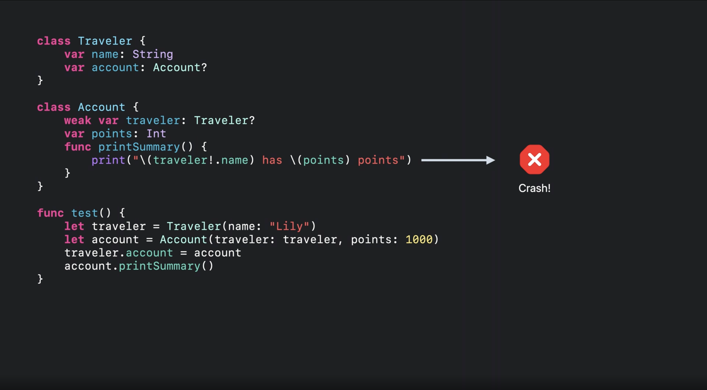
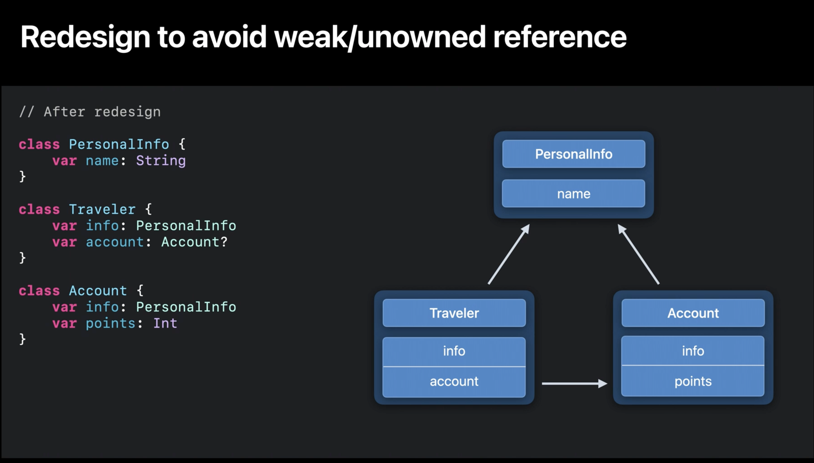

# Navigation Structure
{: .no_toc }

## Table of contents
{: .no_toc .text-delta }

1. TOC
{:toc}

**ARC in Swift: Basics and beyond**

Trong Swift thì chúng ta nên sử dụng value type như là `struct` hay là `enum`.  
Tuy nhiên, có một số trường hợp bắt buộc phải dùng reference type như là `class` thì chúng ta phải hết sức cẩn thận khi sử dụng để tránh reference cycle.  

Reference type trong Swift được quản lý bộ nhớ thông qua ARC (Autoatic Reference Counting).  
Trong bài viết này, chúng ta sẽ cùng tìm hiểu ARC làm việc như nào trong các version sắp tới, và một vài điểm chú ý khi sử dụng reference type.  

## Object's lifetimes

```json
An object’s lifetime in Swift begins at initialization and ends at last use.
ARC automatically manages memory, by deallocating an object after its lifetime ends.
It determines an object’s lifetime by keeping track of its reference counts.
ARC is mainly driven by the Swift compiler which inserts retain and release operations.
At runtime, retain increments the reference count and release decrements it.
When the reference count drops to zero, the object will be deallocated.
```

Từ trước đến giờ chúng ta vẫn luôn hiểu rằng ARC sẽ release một vùng nhớ khi không còn con trỏ nào trỏ vào nó. Ví dụ những vùng nhớ được khai báo trong block code, như function, sẽ được release sau khi content của function này kết thúc.  

Tuy nhiên, trên thực tế, mọi thứ còn hơn thế. Trong một function thì Object's life time được tính từ khi nó được khởi tạo cho đến lần cuối cùng nó được dùng. Sau đó, lifetimes của nó sẽ kết thúc, và nó sẽ được xóa đi.  

Ví dụ, với những function giả sử dài 100 LOC, và chúng ta có object `myObject` nào đó được sử dụng trong khoảng 30 LOC đầu, thì sau khi lần cuối cùng nó được dùng, nó sẽ bị release đi, tức là trong khoảng thời gian 70 LOC còn lại được thực thi, thì vùng nhớ của `myObject` đã không còn tồn tại.

Tham khảo đoạn source code bên dưới:  

```swift
class Traveller {
    var name: String
    var destination: String?
    
    init(name: String) {
        self.name = name
    }
}

func test() {
    let traveller1 = Traveller(name: "NhatHM") // traveller1 Object lifetime begins
    let traveller2 = traveller1
    traveller2.destination = "WWDC21-10216" // traveller1 Object lifetime ends
    print("Done travelling \(traveller2.destination)")
}
```

Ở ví dụ này, ngay sau khi object `traveller1` được gán cho `traveller2` thì nó đã không còn được sử dụng nữa, cho nên, đó cũng chính là thời điểm kết thúc lifetime của object `traveller`. Và lúc này, `traveller1` đã sẵn sàng để bị release.  

Việc release object `traveller1` là do Swift compiler tự xử lý, và thời điểm release là do ARC thực hiện.  

Như hiện tại, với XCode13 thì đã có option để optimize object life time. Tức là, có thể những bug trước đây chưa xảy ra vì coding logic observer đến object life time, thì bây giờ hoàn toàn có thể xảy ra. Bản thân Apple cũng khuyến cáo là khi coding, tránh các logic mà phụ thuộc vào object life time quá nhiều, vì với mỗi version Swift mới thì Swift compiler và ARC optimization có thể thay đổi, dẫn đến những bug tiềm ẩn có thể xảy ra.  


> Note: ở đa số các ngôn ngữ lập trình khác, thì object chỉ bị release khi kết thúc body của function.

## Obserable object lifetimes và vấn đề của nó

Thông qua:  

- `Weak` và `unowned` reference
- Deinitializer (deinit)

Dùng weak và unowned không sai, tuy nhiên trong một số trường hợp, nó rất có thể gây ra bug tiềm ẩn (phụ thuộc vào việc ARC được optimize như nào trong các phiên bản tiếp theo).

```json
Because relying on observed object lifetimes may work today, but it is only a coincidence.

Observed object lifetimes are an emergent property of the Swift compiler and can change as implementation details change.
```

Xem ví dụ dưới (captured from Apple WWDC21 video)


Ở ví dụ trên, ngay sau đoạn code `traveler.account = account` kết thúc thì lifetimes của `traveler` đã kết thúc, và với các version Swift compiler sau này thì có thể xảy ra bug, vì lúc này, `traveler` bị release, do đó reference count đến vùng nhớ của `Traveler` đã bị release, dẫn đến đoạn code trong func `printSummary` sẽ bị crash, nếu dùng `if let` để unwrap value ra thì bản thân function này cũng sẽ bị sai logic, vì lúc này logic mong muốn print ra thông tin của traveler đã không còn được thực hiện.  



Đương nhiên, hiện tại code như trên sẽ chưa thể bug ngay được, vì Swift compiler đang chưa optimize đến mức là vừa kết thúc lifetimes của object thì object sẽ bị release đi luôn. Tuy nhiên, với sections này thì Apple đang nhắc nhở chúng ta vì việc tương lai, chắc chắn là việc xử lý memory của object lifetimes sẽ được thực hiện mạnh tay hơn, có thể ngay sau dòng code cuối cùng mà object được gọi thì nó sẽ bị release, và như vậy, source code của chúng ta chưa bug ở thời điểm này, nhưng tương lai có thể sẽ bị bug.  

## How to fix

Trong video, Apple gợi ý 3 cách fix:

- Sử dụng [withExtendedLifetime](https://developer.apple.com/documentation/swift/1541033-withextendedlifetime)
- Thay đổi solution code, sử dụng strong reference.
- Thay đổi cách code, tránh sử dụng weak/unowned

### Dùng withExtendedLifetime (không khuyến khích)


### Sử dụng strong references


### Thay đổi cách code tránh các object reference lẫn nhau (khuyến khích)



Kết luận:

- Object lifetimes không tồn tại suốt vòng đời của function, mà chỉ tồn tại từ khi khởi tạo object -> lần cuối cùng object được sử dụng.
- ARC optimization có thể thay đổi sau mỗi version của Swift (và Swift compiler), do đó, việc implement source code phụ thuộc quá nhiều vào object lifetimes tiềm ẩn bug.

Nguồn:

- [https://developer.apple.com/videos/play/wwdc2021/10216](https://developer.apple.com/videos/play/wwdc2021/10216)
